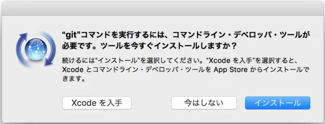

# GitHub のリポジトリを VS Code で開こう

## このトピックでの目標

GitHub のリポジトリをクローンして VS Code で表示できるようになる

## Git を使う準備をする

Git をインストールしていない方は以下の手順でインストールを行ってください。
Windows / macOS どちらの環境でもすべてデフォルトの設定で問題ありません。

### Windows 環境

[Git for Windows](https://gitforwindows.org/)から Git のインストーラーをダウンロードし、インストールを行ってください。


### macOS 環境

git コマンドを初めて実行したときにインストールがされているかどうかの行われるため、Git のインストーラーの実行などはありません。

### ターミナルを開き、Git がインストールされていることを確認する

VS Code を開き、上部メニューバーの「ターミナル(T)」→「新しいターミナル」をクリックします。


すると画面下部にターミナルが表示されます。


ターミナルで以下のコマンドを入力し、Git のバージョンが正しく表示されれば OK です。

```bash
git --version
```


**macOS** の場合、環境によっては `コマンドライン・デベロッパ・ツール` のインストールが求められる場合があります。
以下のような画面が表示された場合は、コマンドライン・デベロッパ・ツールを**インストール**するようにしてください。



## GitHub からリポジトリをクローンする

では、GitHub からリポジトリをクローンしてみましょう。

### Step1: クローンするリポジトリの GitHub ページを開く

任意の Web ブラウザで、以下のページにアクセスします。

- [Hello VS Code ハンズオン 参加者向けガイド](https://github.com/vscodejp/handson-hello-vscode)

GitHub のページで緑色の `Code` と表示されているボタンを**選択**します。


以下のようなホップアップが表示されるので、赤枠の部分にある`クリップボード`のボタンを**選択**し、Git でこのリポジトリをクローンするための URL を**コピー**します。


### Step2: リポジトリをクローンする

VS Code を起動し、画面上部にある`メニューバー`の「ターミナル」→「新しいターミナル」を**選択**します。


すると画面下部にターミナルが表示されます。


表示されたターミナル内にて、下記のコマンドを入力します。
\<Step1 でコピーした URL\> は、Step1 で取得した URL に置き換えてください。

```
git clone <Step1でコピーしたURL>
```

以下のようなメッセージが表示されれば、OK です。


### Step3: クローンしたリポジトリを VS Code で表示する

VS Code の上記`メニューバー`で「ファイル」→「フォルダを開く」を**選択**します。

Windows 環境の場合、以下のような画面が出るため、先程クローンしたフォルダである`handson-hello-vscode` を**選択**します。


フォルダを開くと、以下のように `handson-hello-vscode` のリポジトリを VS Code で開くことができます。
フォルダの内容が画面左部にあるファイルツリーに表示されていれば OK です。


